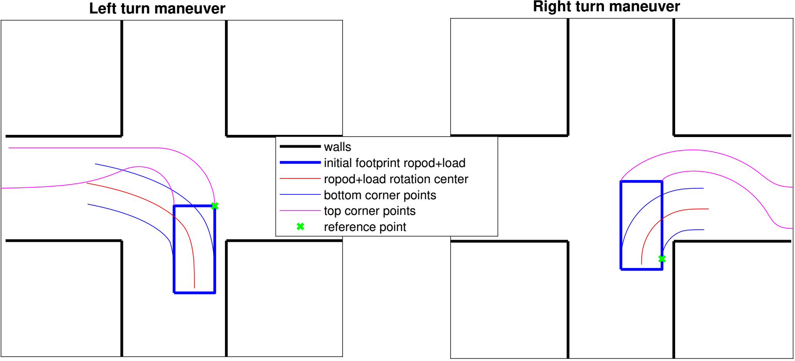
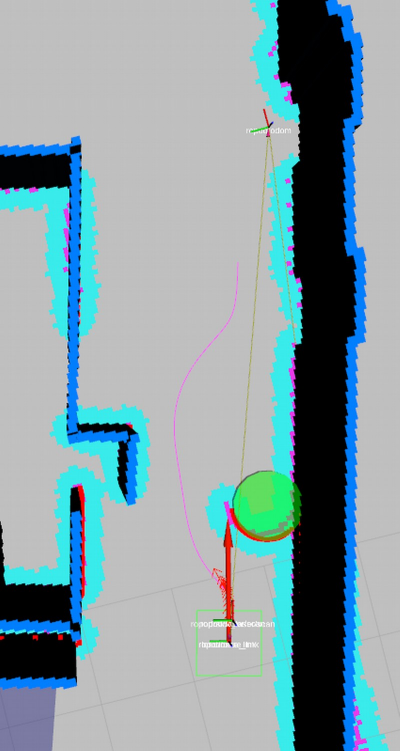

# Maneuver based navigation

## 1. Overview
The maneuver-based navigation aims to provide a simple yet efficient of motion planning for differential drive robots with rectangular footprints. The motion planner targets structured indoor environments like those of office building, hospitals, etc., where the robot have to navigate mainly through corridors and intersections.

To navigate to a desired goal in the vicinity of the robot, it is desirable to perform a limited set of movements or maneuvers that eventually can help people in the proximity of the robot to predict its behavior. The maneuvers should also take into account over-sized dimensions of robots carrying a load. To meet those requirements, we propose first a basic set of three maneuvers, move straight, turn left in an intersection and turn right in an intersection. An illustration of the turn left-right maneuvers is shown in the Figure below.

We start by defining a trajectory composed by straight-lines and circles, other choices like clothoids or bezier-curves are also possible. Next, such trajectory is assigned to a reference point on the robot footprint. For instance for the left-turn maneuver, such point is placed at the top-right corner of the footprint. The motivation is that we are interested in keeping such point parallel to the wall of the corridor we will enter. For the right-turn maneuver, we placed the point on the right hand side of the vehicle, as to keep that side away from the corner. This strategy allows the robot to find a wall-collision-free trajectory for turning in intersections.

We have parametrized the trajectories in order to explore several possibilities, for instance by parameterizing the radius of the reference point trajectory and even having multiple reference points. In the current strategy we explore an ordered set of reference points and then a set of circle radii until the first collision-free trajectory is found.

We can the compose several of these basic maneuvers to for instance create change of lane, or overtake maneuvers to avoid obstacles. Once again, the maneuvers can be parametrized in order to explore the free space. An example of an overtake maneuver is shown in the Figure below.

## 2. Node API

### 2.1 Topics
#### 2.1.1 Published topics
##### 2.1.1.1 Maneuver navigation
**&#x223C;<name\>/cmd_vel(geometry_msgs/Twist)**\
&nbsp;&nbsp;&nbsp;&nbsp; Velocity commands to be executed by the robot

**&#x223C;<name\>/maneuver_navigation/feedback(geometry_msgs/PoseStamped)**\
&nbsp;&nbsp;&nbsp;&nbsp; Current position of the robot

**&#x223C;<name\>/maneuver_navigation/goal_rviz(geometry_msgs/PoseStamped)**\
&nbsp;&nbsp;&nbsp;&nbsp; Last goal received. Used for visualization purposes
#### 2.1.2 Subscribed topics
**&#x223C;<name\>/route_navigation/simple_goal(geometry_msgs/PoseStamped)**\
&nbsp;&nbsp;&nbsp;&nbsp; Simple goal containing only a pose

**&#x223C;<name\>/route_navigation/goal(/route_navigation/goal)**\
&nbsp;&nbsp;&nbsp;&nbsp; Goal containing pose and additional configuration of the planner for adaptibility. See message types section.

**&#x223C;<name\>/route_navigation/cancel(std_msgs/Bool)**\
&nbsp;&nbsp;&nbsp;&nbsp; Set to true to cancel the current navigation. A zero velocity command is sent as well.

**&#x223C;<name\>/route_navigation/set_load_attached(std_msgs/Bool)**
&nbsp;&nbsp;&nbsp;&nbsp; When set to true, the navigation is reset and the parameters specified in the file indicated by\
&nbsp;&nbsp;&nbsp;&nbsp; &#x223C;<name\>/default_ropod_load_param_file are loaded. When is set to false, the parameters\
&nbsp;&nbsp;&nbsp;&nbsp; in the file indicated by  &#x223C;<name\>/default_ropod_navigation_param_file are loaded.\
&nbsp;&nbsp;&nbsp;&nbsp; By default it is assume the ropod is not attached to a load.

**&#x223C;<name\>/odom (nav_msgs/Odometry)**\
&nbsp;&nbsp;&nbsp;&nbsp; The local planner make use of the robot's odometry for local path planning.
#### 2.1.3 Extra topics
##### 2.1.3.1 Local costmap
We make use of the [Costmap 2D](http://wiki.ros.org/costmap_2d) as local costmap. . Please refer to their website for additional published and subscribed topics.
##### 2.1.3.2 TEB local planner
We make use of the [TEB Local planner](http://wiki.ros.org/teb_local_planner) to execute the maneuvers. Please refer to their website for additional published and subscribed topics.

### 2.2 Message types
**/route_navigation/goal**\
*geometry_msgs/PoseStamped start *: start pose of plan.\
*geometry_msgs/PoseStamped goal* : goal pose of plan.\
*Configuration conf*\
&nbsp;&nbsp;&nbsp;&nbsp;*bool use_line_planner *: whether or not plan straight line trajectories, useful for holonomic robots.\
&nbsp;&nbsp;&nbsp;&nbsp;*bool precise_goal* :  use tight tolerances to reach a goal. If after a maneuver the goal is not reached, the goal is resent.

### 2.3 Parameters
**&#x223C;<name\>/default_ropod_navigation_param_file(string, default: "")**\
&nbsp;&nbsp;&nbsp;&nbsp; Contains the default parameters of the robot's footprint and local planner that are used when the ropod\
&nbsp;&nbsp;&nbsp;&nbsp; *does not have* a load attached.

**&#x223C;<name\>/default_ropod_load_param_file(string, default: "footprint_local_planer_params_ropod_load.yaml")**\
&nbsp;&nbsp;&nbsp;&nbsp; Contains the default parameters of the robot's footprint and local planner that are used when the ropod\
&nbsp;&nbsp;&nbsp;&nbsp; *have* a load attached.

#### 2.3.1 Manuever planner
**&#x223C;<name\>/maneuver_planner/step_size (double, default: 0.05 (localcostmap default))**\
&nbsp;&nbsp;&nbsp;&nbsp; Step size used to generate the reference point trajectories.

**&#x223C;<name\>/maneuver_planner/use_last_goal_as_start (bool, default: false)**\
&nbsp;&nbsp;&nbsp;&nbsp; When true, the last received goal is stored and used as starting pose for maneuver planning.
&nbsp;&nbsp;&nbsp;&nbsp; To be used only with with a simple_goal (see subscribed topics.

#### 2.3.1 Manuever navigation
#### 2.3.2 Local costmap
We make use of the [Costmap 2D](http://wiki.ros.org/costmap_2d) as local costmap. . Please refer to their website for the corresponding parameters.
#### 2.3.3 TEB local planner parameters
We make use of the [TEB Local planner](http://wiki.ros.org/teb_local_planner) to execute the maneuver. Please refer to their website for the parameters.
#### 2.3.4 Footprint
The robot footprint is defined in two places and it must be taken care of that they are identical. One is at the [Costmap 2D](http://wiki.ros.org/costmap_2d) parameters and the other is at the [TEB Local planner](http://wiki.ros.org/teb_local_planner) parameters.
